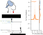

# Analysis code for electrophysiological data collected from combined brain and spinal stimulation

1. **Citation**  
   This code was used in the following [manuscript](https://doi.org/10.1101/2025.04.17.25326011):

   ```bibtex
   @article {Murray2025.04.17.25326011,
     author = {Murray, Lynda M. and McIntosh, James R. and Goldsmith, Jacob A. and Wu, Yu-Kuang and Liu, Mingxiao and Sanford, Sean P. and Joiner, Evan F. and Mandigo, Christopher and Virk, Michael S. and Tyagi, Vishweshwar and Carmel, Jason B. and Harel, Noam Y.},
     title = {Timing-dependent synergies between noninvasive motor cortex and spinal cord stimulation in chronic cervical spinal cord injury},
     elocation-id = {2025.04.17.25326011},
     year = {2025},
     doi = {10.1101/2025.04.17.25326011},
     publisher = {Cold Spring Harbor Laboratory Press},
     URL = {https://www.medrxiv.org/content/early/2025/04/19/2025.04.17.25326011},
     journal = {medRxiv}
   }
   ```

<p align="center">
  
</p>

2. **Installation**  
   - If you don't already have **conda** or **miniconda**, install it from the [Miniconda download page](https://docs.conda.io/en/latest/miniconda.html).  
   - On **Windows**, we recommend using Windows Subsystem for Linux (WSL). Setup instructions are available [here](https://learn.microsoft.com/en-us/windows/wsl/install).

   After downloading the project files and navigating to the project folder:

   ```bash
   conda create --name brain-spinal-pairing python=3.11
   conda activate brain-spinal-pairing
   pip install .         # or: pip install .[dev]
   ```

   This creates and activates the environment `brain-spinal-pairing`.  

   > Note: Versioning tied to the manuscript is available under specific releases. medRxiv version DOI is [Zenodo](https://doi.org/10.5281/zenodo.15251949). 
   > Installation tested on Ubuntu 24.04 and 22.04 (WSL).

3. **Running**  
   From the project root, after installation:

   - `python run_core.py` fits the brain-spinal-pairing models.  
     This script will automatically download non-invasive data from [Zenodo](https://doi.org/10.5281/zenodo.15225065).
   - `python run_hbmep.py` fits recruitment curve models using [hbMEP](https://github.com/jamesmcintosh91/hbmep).
   - `python run_analysis.py` generates figures.

   > Note: `run_core.py` and `run_hbmep.py` may take several hours. After data is downloaded, `run_core.py` can be accelerated using `--n_jobs` > 1.

4. **License**  
   The code is available under the [MIT License](LICENSE).
