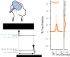

# Analysis code for electrophysiological data collected from combined brain and spinal stimulation

1. **Citation**  
   TBD.

  

2. **Installation**:  
   - If you don't already have **conda** or **miniconda**, install it from the [Miniconda download page](https://docs.conda.io/en/latest/miniconda.html).  
   - If you're using Windows, it's recommended to use Windows Subsystem for Linux (WSL). Instructions for setting up WSL can be found [here](https://learn.microsoft.com/en-us/windows/wsl/install).

   After downloading the project files and navigating to the project folder, create and activate the conda environment:
   - `conda create --name brain-spinal-pairing python=3.11`
   - `conda activate brain-spinal-pairing`
   - `pip install .` or `pip install .[dev]`  
   - `brain-spinal-pairing` itself will be the environment that you need to point to.

   Note that the versions used with the manuscript have their own releases.  
   Installation tested only on Ubuntu 24.04 and Ubuntu 22.04 (WSL).

3. **Running**:  
   To replicate non-invasive analysis, navigate to the root directory after installing.
   - `python run_core.py` will fit the brain-spinal-pairing models. Non-invasive data will be automatically downloaded from [10.5281/zenodo.15225065](https://doi.org/10.5281/zenodo.15225065) at this stage.
   - `python run_hbmep.py` will fit the recruitment curve models based on [hbMEP](https://github.com/jamesmcintosh91/hbmep).
   - `python run_analysis.py` will produce figures.  

   Note that `run_core.py` and `run_hbmep.py` will take several hours to run. After the data is downloaded, run_core.py can be restarted with the --n_jobs flag >1 to speed things up. 

4. **License**:  
   The `brain-spinal-pairing` code is free software made available under the MIT License. For details see the LICENSE file.

